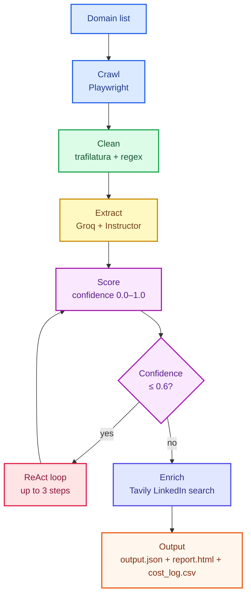
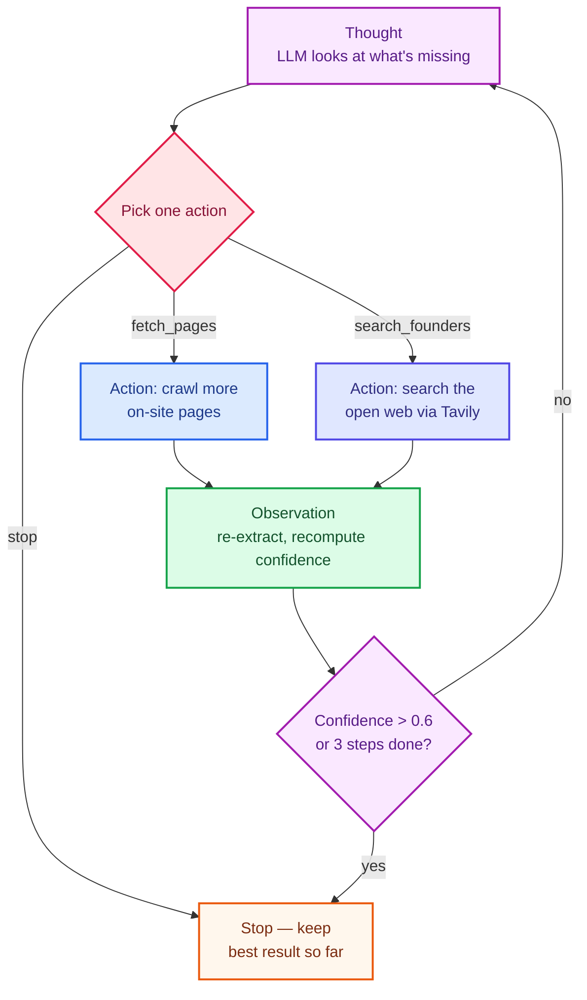

# Autonomous Lead Enrichment Agent

An agent that takes a list of company domains, crawls their public web
presence with a real headless browser, and turns the mess of marketing-site
HTML into structured, sales-ready intelligence — company overview, ICP,
contact emails, and key team members with roles and LinkedIn URLs — each
record backed by a confidence score you can actually audit.

It also ships as an **MCP server**, exposing the same crawling/extraction
building blocks as tools any MCP client (Claude Desktop, Claude Code) can
call directly.

```
Input:  ["postman.com", "supabase.com", "vapi.ai"]
Output: output.json, report.html, cost_log.csv
```

---

## Table of contents

- [Pipeline overview](#pipeline-overview)
- [Agentic follow-up hop](#agentic-follow-up-hop-bonus)
- [Project structure](#project-structure)
- [Setup](#setup)
- [Usage](#usage)
- [MCP server](#mcp-server-bonus)
- [Testing](#testing)
- [Design decisions & real bugs found](#design-decisions--real-bugs-found)
- [Rubric coverage](#rubric-coverage)
- [Operations question](#operations-question)

---

## Pipeline overview



Every stage fails **independently** and is caught at three nested levels —
page fetch, LLM call, whole-domain — so one broken site can never crash a
batch run (`src/pipeline.py`).

| Stage | File | Tool | Why |
|---|---|---|---|
| Crawl | `crawler.py` | Playwright | Renders JS-heavy sites (Next.js/React) that `requests` returns empty |
| Clean | `extractor.py` | trafilatura + regex | Strips boilerplate for token savings; regex recovers hrefs trafilatura drops |
| Extract | `llm_client.py` | Groq (Instructor) → Gemini fallback | Structured, validated output — never raw-text parsing |
| Score | `confidence.py` | pure Python | Deterministic, auditable — not an LLM guess |
| ReAct loop | `agentic.py` | Groq | LLM picks fetch_pages / search_founders / stop, up to 3 rounds |
| Enrich | `search_fallback.py` | Tavily | Finds LinkedIn URLs + broad founder search when the site has none |
| Cost | `cost_log.py` | — | Per-domain token + estimated cost logging |

---

## Agentic follow-up loop — ReAct pattern (bonus)

This is the "dynamic navigation" bonus criterion, built as an explicit
**ReAct loop** (Reason → Act → Observe → repeat) rather than a single
scripted fallback. It lives in its own module, `src/agentic.py`, because
it's a genuinely different concern from the rest of the pipeline: everything
else is a straight-through pass; this is the part that loops and makes its
own decisions, choosing between **two different tools**:



Verified against real sites, not synthetic scenarios:
- **`fathom.video`**: the agent reasoned *"investors/board pages often have
  leadership bios"* (`fetch_pages`) and went and checked — a genuine
  decision, not a scripted fallback.
- **`linear.app`**: on-site `fetch_pages` attempts found nothing (Linear
  simply doesn't publish a leadership page), so on a later round the agent
  correctly switched to `search_founders` — which found Linear's real
  co-founders (Karri Saarinen, Jori Lallo, Tuomas Artman) via the open web.

Capped at `MAX_STEPS = 3` so a stubborn site can't spiral into unbounded
LLM calls; the loop also exits early the moment confidence clears 0.6.

---

## Project structure

```
Softwarebrio/
├── src/
│   ├── models.py          # Pydantic schemas — the contract every stage agrees on
│   ├── config.py          # centralized env vars
│   ├── crawler.py         # Playwright: fetch + subpage discovery
│   ├── extractor.py       # trafilatura cleaning + regex link/email recovery
│   ├── confidence.py      # deterministic 0–1 scoring
│   ├── llm_client.py      # Groq (Instructor) primary, Gemini fallback, ReAct decision step
│   ├── agentic.py         # ReAct loop: Thought → Action → Observation      [bonus]
│   ├── search_fallback.py # Tavily LinkedIn search + broad founder search  [bonus]
│   ├── cost_log.py        # token/cost tracking                            [bonus]
│   ├── report.py          # output.json → readable report.html             [bonus]
│   ├── pipeline.py        # orchestrator, 3-layer error isolation
│   ├── main.py            # CLI entrypoint
│   └── mcp_server.py      # MCP tools wrapping the same functions          [bonus]
├── tests/                 # 32 tests — 18 pure unit, 14 hitting real network/APIs
├── output.json            # sample run: postman.com, supabase.com, vapi.ai
├── report.html            # human-readable version of the same run
├── cost_log.csv
├── requirements.txt / .env.example / pytest.ini
└── README.md
```

---

## Setup

```bash
python -m venv venv
source venv/Scripts/activate      # Windows: venv\Scripts\activate
pip install -r requirements.txt
python -m playwright install chromium

cp .env.example .env
```

Fill in `.env`:

| Variable | Required? | Get it at |
|---|---|---|
| `GROQ_API_KEY` | ✅ required | [console.groq.com](https://console.groq.com) — free |
| `GEMINI_API_KEY` | optional (fallback) | [aistudio.google.com/apikey](https://aistudio.google.com/apikey) — free |
| `TAVILY_API_KEY` | optional (bonus) | [tavily.com](https://tavily.com) — free tier |

---

## Usage

```bash
# the 3 assignment domains
python -m src.main --domains postman.com supabase.com vapi.ai

# same, plus a human-readable report
python -m src.main --domains postman.com supabase.com vapi.ai --report
# → report.html — open in a browser, Ctrl+P → Save as PDF

# try it on your own domains — any list works
python -m src.main --domains stripe.com linear.app notion.so --report

# custom output path
python -m src.main --domains stripe.com --output stripe_only.json
```

Or drive individual pieces in Python:

```python
import asyncio
from src.pipeline import process_domain

result = asyncio.run(process_domain("stripe.com"))
print(result.model_dump_json(indent=2))
```

---

## MCP server (bonus)

```bash
python -m src.mcp_server
```

Exposes 5 tools any MCP client can call independently:

| Tool | Does |
|---|---|
| `crawl_domain(domain)` | Fetch homepage + discover/fetch relevant subpages |
| `extract_clean_text(domain)` | Crawl + return clean, LLM-ready markdown |
| `extract_company_intel(domain)` | Full structured extraction (overview, ICP, emails, team) |
| `find_linkedin(name, company)` | Tavily search for a person's LinkedIn URL |
| `find_company_leadership(domain)` | Broad open-web search for founders/execs when the site itself has no leadership page |

**Use it from Claude Desktop** — add to `claude_desktop_config.json`
(macOS: `~/Library/Application Support/Claude/claude_desktop_config.json`,
Windows: `%APPDATA%\Claude\claude_desktop_config.json`):

```json
{
  "mcpServers": {
    "lead-enrichment": {
      "command": "C:\\path\\to\\Softwarebrio\\venv\\Scripts\\python.exe",
      "args": ["-m", "src.mcp_server"],
      "cwd": "C:\\path\\to\\Softwarebrio",
      "env": {
        "GROQ_API_KEY": "your-key-here",
        "TAVILY_API_KEY": "your-key-here"
      }
    }
  }
}
```

Restart Claude Desktop, then ask it something like *"use the
lead-enrichment tools to get company intel for stripe.com"* — it calls the
tools directly.

---

## Testing

```bash
pytest tests/ -v                       # everything — 32 tests, ~3-4 min
pytest tests/test_confidence.py -v     # pure logic only, no network, instant
pytest -m integration -v               # real network/LLM/search calls
pytest -m e2e -v -s                    # full pipeline against the 3 assignment domains
```

| Suite | Count | Needs network? | Needs API keys? |
|---|---|---|---|
| `test_confidence.py`, `test_extractor.py`, `test_report.py` | 12 | ❌ | ❌ |
| Pure-logic tests inside `test_agentic_hop.py` / `test_search_fallback.py` | 6 | ❌ | ❌ |
| `test_crawler.py` | 3 | ✅ | ❌ |
| `test_llm_client.py` + agentic-loop tests hitting Groq | 8 | ✅ | ✅ Groq |
| `test_search_fallback.py` (LinkedIn + founder search) | 2 | ✅ | ✅ Groq + Tavily |
| `test_pipeline_e2e.py` | 1 | ✅ | ✅ Groq |

---

## Design decisions & real bugs found

Built by actually running this against `postman.com`, `supabase.com`, and
`vapi.ai` repeatedly — not just writing code that looked plausible. Every
item below is a real failure this project hit and how it got fixed.

| Decision / bug | What happened | Fix |
|---|---|---|
| Playwright over `requests`+BeautifulSoup | Modern marketing sites render team/pricing client-side; raw HTTP GET returns an empty `<div id="root">` | Headless Chromium executes the JS first |
| `networkidle` → `domcontentloaded` | `postman.com` **never** triggers `networkidle` — persistent analytics/chat connections keep the network "busy" forever, so every fetch timed out despite the page rendering fine | Switched to `domcontentloaded` + a short fixed settle delay |
| trafilatura drops hrefs | `include_links=True` keeps the anchor *text* ("LinkedIn") but silently drops the actual URL in markdown output — exactly the data this project needs | Added a separate regex pass over raw HTML for LinkedIn URLs + emails, appended as its own context section |
| Stale Groq model name | `llama-3.3-70b-versatile` no longer exists on Groq's API (`404 model_not_found`) | Queried `client.models.list()` live, switched to `openai/gpt-oss-120b` |
| `httpx` / `groq` version clash | `httpx==0.28` dropped the `proxies` kwarg the pinned `groq` SDK version needed → `TypeError` on client init | Pinned `httpx==0.27.2` |
| Tavily subdomain miss | Regex anchored to `www.linkedin.com` silently missed real matches like `in.linkedin.com/in/...` (Tavily returns country-coded subdomains often) | Widened the regex to any subdomain, added a regression test |
| Confidence score computed in Python, not asked from the LLM | Asking an LLM "rate your confidence 0-1" is ungrounded and unauditable | Weighted rubric based on which fields were actually found — every score traces back to a concrete reason |
| Two Pydantic models, not one | Letting the LLM fill `confidence_score`/`llm_source` directly mixes model guesses with deterministic facts | `ExtractedIntel` (LLM-facing) vs. `CompanyIntel` (final record with computed fields) |
| HTML report instead of a PDF library | `weasyprint`/`wkhtmltopdf` need system-level GTK/Qt deps, painful on Windows for a short deadline | Generate `report.html`; Ctrl+P → Save as PDF gets the same result with zero fragile installs |
| Script/JSON blobs leaking into extracted emails | Tested against `stripe.com`: Next.js embeds a `__NEXT_DATA__` JSON blob in `<script>` full of **documentation code-sample emails** (`jane.smith@example.com`) that have nothing to do with real contacts — one even leaked a raw JSON-escape artifact, `u003esales@stripe.com` (the escape sequence for `>`), because the regex scanned straight through script content | Strip `<script>`/`<style>` blocks before running any link/email regex; also blocklist common placeholder domains (`example.com`, `test.com`, etc.) |
| Confidence-threshold boundary bug | Whenever `team_members` is empty but overview/audience/emails are found, `compute_confidence` lands at **exactly** 0.25+0.15+0.20 = 0.60 — a strict `confidence < 0.6` check for triggering the agentic loop silently never fired for precisely this, the single most common gap | Changed the loop-entry trigger to `confidence <= 0.6` |
| LLM confused customer testimonials with the company's own team | Tested against `linear.app`: homepage customer quotes ("_Patrick Collison, CEO, Stripe_" praising Linear) were extracted as **Linear's own team members** — the names/roles were read correctly, just attributed to the wrong company | Added an explicit prompt rule: reject anyone whose stated role names a company other than the one being researched |
| Placeholder email not caught by domain blocklist | `kevin@encom.com` (Encom — the fictional company from *Tron*, classic contact-form filler text) passed the `example.com`-style blocklist since it's not one of the known placeholder domains | Rather than growing the blocklist forever, taught the LLM in the prompt to reason about plausibility — "does this look like a real contact point or form filler text?" |
| Founder-search schema mismatch | `find_company_leadership`'s first version used `max_retries=1` for its structured-extraction call. The model correctly identified Linear's real co-founders but used a field named `"title"` instead of our schema's `"role"` — with only 1 attempt, Instructor had no room to resubmit the validation error for self-correction, so the whole call raised and silently returned `[]` | Bumped to `max_retries=2` (matching the primary extraction call), letting Instructor's built-in retry-with-feedback loop actually run |
| Agentic hop never tried the open web | The original single-hop version could only retry on-site page fetches — if a company (like `linear.app`) genuinely publishes no leadership page anywhere on its own site, there was nothing left to try | Rebuilt as a multi-step ReAct loop (`src/agentic.py`) where the LLM can choose `search_founders` (Tavily) as a distinct tool, not just `fetch_pages` |

---

## Rubric coverage

| Criterion | Weight | Where it's addressed |
|---|---|---|
| Agent & Scraping Architecture | 30% | `crawler.py` (Playwright + concurrent subpage fetch), `agentic.py` (ReAct loop) |
| LLM & Structured Output Quality | 25% | Instructor + Pydantic (`llm_client.py`), dual-provider fallback |
| Error Handling & Resilience | 20% | 3-layer try/except (`pipeline.py`), bot-block detection, retry/backoff |
| Code Quality & Documentation | 15% | Modular `src/` layout, type hints, this README |
| Loom Walkthrough | 10% | Code structure → live test run → live pipeline run → real bugs found |

---

